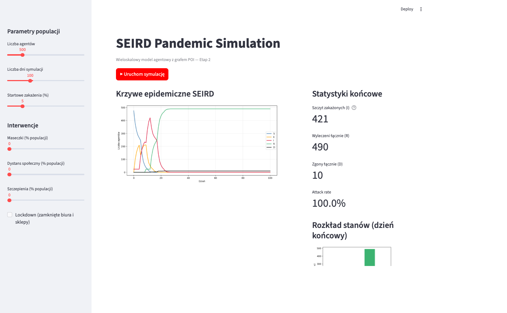
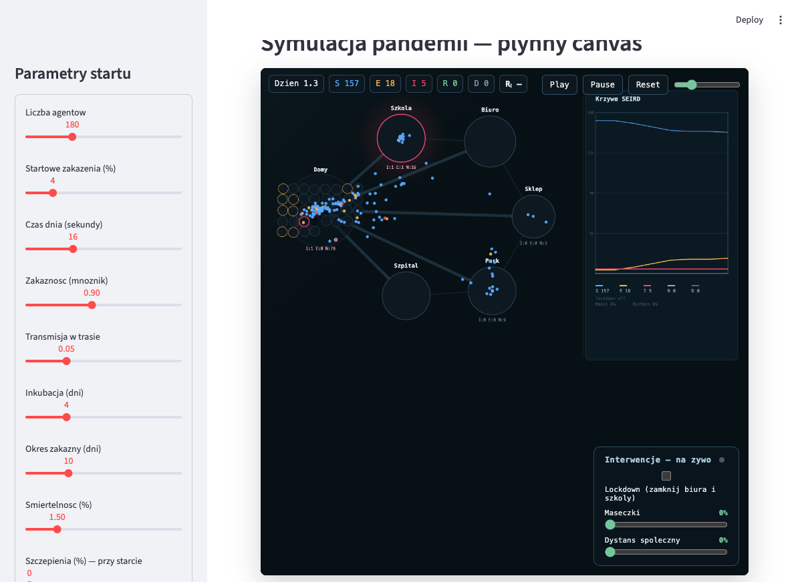

# Wieloskalowa agentowa symulacja pandemii wirusowej

> **Multi-scale Agent-Based Model of viral pandemic spread in an urban environment.**  
> Projekt zaliczeniowy — Modelowanie i Symulacja Systemów, Informatyka WI AGH, 2026.


---

## Przegląd

Symulacja agentowa (ABM) rozprzestrzeniania się pandemii wirusowej w środowisku miejskim opartym na grafie węzłów POI (*Points of Interest*). Każdy agent posiada indywidualne atrybuty demograficzne, kliniczne i behawioralne. Mikroskopowe interakcje między agentami generują emergentną dynamikę epidemiczną na poziomie populacji.

Model integruje kompartmentową mechanikę SEIRD z realistyczną topologią miejską, umożliwiając ilościowe porównanie scenariuszy interwencji epidemicznych — od lockdownu, przez szczepienia, po wpływ indywidualnej higieny i superspreaderów.

**Kluczowe wyniki (N = 500, 7 powtórzeń, 180 dni):**

| Scenariusz | Attack rate | Peak I | Zgony | vs. baseline |
|---|---|---|---|---|
| Bazowy (brak interwencji) | 75,1% | 88 | 7 | — |
| **Lockdown** | **3,5%** | **14** | **1** | **−96% AR** |
| Szczepienia 60% | 49,1% | 40 | 3 | −35% AR, −55% zgonów |
| Superspreaderzy 5% | 78,7% | 100 | 7 | +4 p.p. AR |
| Wysoka higiena (Θ = 0,85) | 60,8% | 57 | 5 | −14% AR, szczyt +11 dni |

---

## Interfejs aplikacji

| Streamlit Dashboard | Real-time Canvas |
|---|---|
|  |  |
| Konfiguracja parametrów, wykresy SEIRD, statystyki końcowe | Agenci poruszają się między węzłami POI; interwencje na żywo |

---

## Model epidemiologiczny SEIRD

Każdy agent przechodzi przez rozszerzony zestaw stanów klinicznych:

```
S (Podatny) ──λ(t)──► E (Inkubacja) ──σ──► I (Zakaźny) ──γ──► R (Wyleczony)
                                                        └──μ──► D (Zgon)
```

| Parametr | Symbol | Wartość domyślna |
|---|---|---|
| Okres inkubacji | 1/σ | 4 dni |
| Czas zakaźności | 1/γ | 8 dni |
| Wskaźnik śmiertelności CFR | μ | 2% |
| Bazowy mnożnik transmisji | p\_mult | 0,16 |
| Emergentne R₀ | — | ≈ 2,5 |

**Ładunek wirusowy** (`viral_load`) — ciągła zmienna agenta narastająca pod koniec fazy E, szczytująca na początku I i malejąca przy zdrowieniu. Bezpośrednio skaluje siłę zakażenia w każdej interakcji.

### Formuła transmisji

Prawdopodobieństwo zakażenia podatnego agenta w węźle POI:

```
P_inf = (1 − ∏ᵢ (1 − p_eff,i)^(viral_load_i)) · (1 − immunity)
```

Modyfikatory `p_eff`: maseczki (η_M = 0,5), dystans społeczny (−20%), higiena rąk (±30%).  
Ograniczenie `MAX_INFECTIOUS_CONTACTS = 5` zapobiega nierealistycznej saturacji w dużych węzłach.

---

## Architektura środowiska

Graf węzłów POI skalowany proporcjonalnie do N:

```
                        ┌─────────────────────────────────────────┐
                        │           MIASTO (graf POI)             │
                        │                                         │
  ┌──────────┐          │  ┌──────┐  ┌──────┐  ┌──────┐         │
  │  Agent   │─────────►│  │ DOM  │  │BIURO │  │SZKOŁA│         │
  │ SEIRD    │          │  │N/4   │  │N/25  │  │N/30  │         │
  │ atrybuty │          │  └──────┘  └──────┘  └──────┘         │
  └──────────┘          │                                         │
                        │  ┌──────┐  ┌──────┐  ┌──────────┐    │
                        │  │SKLEP │  │PARK  │  │PRZYCHODNIA│    │
                        │  │N/50  │  │N/100 │  │N/200      │    │
                        │  └──────┘  └──────┘  └──────────┘    │
                        └─────────────────────────────────────────┘
```

| Typ węzła | p_base | Docelowe zagęszczenie |
|---|---|---|
| Gospodarstwo domowe | 0,35 | ~4 osoby |
| Szkoła | 0,30 | ~30 uczniów |
| Biuro | 0,20 | ~25 pracowników |
| Placówka zdrowotna | 0,15 | — |
| Sklep | 0,10 | rotacja |
| Park | 0,03 | przestrzeń otwarta |

### Dzienny harmonogram agenta

```
każdy krok (1 dzień):
  1. Dom                   — zawsze (klaster rodzinny)
  2. Praca / Szkoła        — jeśli nie lockdown
  3. Sklep                 — p = 0.30 × contact_rate (pominięty przy lockdown / SD)
  4. Park                  — p = 0.18 × contact_rate (pominięty przy lockdown)
```

---

## Atrybuty agentów

| Atrybut | Typ | Rola |
|---|---|---|
| `age` | int [0–80] | Mobilność, śmiertelność |
| `state` | enum SEIRD | Stan kliniczny |
| `viral_load` | float [0–1] | Siła emisji patogenu |
| `immunity` | float [0–1] | Podatność na zakażenie |
| `vaccinated` | bool | −50% podatności, −80% zgonów |
| `wears_mask` | bool | p_eff × (1 − η_M) |
| `social_distancing` | bool | p_eff × 0,8; pomija sklepy |
| `hygiene_score` Θ_H | float [0–1] | Czynnik h ∈ [0,70; 1,30] |
| `contact_rate` | float | Skaluje p_shop, p_park |

**Profil superspreader:** `contact_rate = 3.0`, `hygiene_score = 0.1`

---

## Szybki start

**Wymagania:** Python 3.10+, [uv](https://docs.astral.sh/uv/)

```bash
# Klonowanie i instalacja zależności
git clone <repo-url>
cd pandemic-simulation
uv sync --extra dashboard

# Uruchomienie symulacji (100 kroków, N = 500)
uv run python scripts/run_simulation.py

# Testy jednostkowe (25 testów)
uv run pytest

# Pokrycie testów
uv run pytest --cov=simulation tests/
```

### Dashboard Streamlit

```bash
# Dashboard statyczny — konfiguracja parametrów i wykresy SEIRD
uv run streamlit run scripts/dashboard.py

# Animacja real-time — agenci w węzłach POI, interwencje na żywo
uv run streamlit run scripts/realtime_canvas.py
```

### Eksperymenty Stage 3

```bash
# Uruchomienie wszystkich 5 scenariuszy (7 powtórzeń × 180 kroków)
uv run python scripts/experiment_stage3.py

# Wyniki zapisywane do:
#   data/output/stage3_*.png
#   data/output/stage3_stats.txt
```

### Konfiguracja przez YAML

```bash
# Przykładowe pliki konfiguracyjne:
configs/pathogen_base.yaml
configs/scenario_lockdown.yaml
configs/scenario_vaccination.yaml
configs/scenario_superspreaders.yaml
configs/scenario_hygiene_high.yaml
```

Przykładowy plik konfiguracyjny (`configs/scenario_vaccination.yaml`):

```yaml
pathogen:
  incubation_period: 4
  infectious_period: 8
  p_death: 0.02
  initial_infected_frac: 0.02

transmission:
  p_base_multiplier: 0.16
  eta_m: 0.5
  p_transit: 0.0

vaccination_coverage: 0.60
lockdown: false
```

### Użycie programatyczne

```python
from simulation.model import EpidemicModel

model = EpidemicModel(
    n_agents=500,
    vaccination_coverage=0.60,
    lockdown=False,
    superspreader_fraction=0.05,
    mean_hygiene=0.85,
)

for _ in range(180):
    model.step()

df = model.datacollector.get_model_vars_dataframe()
print(df[["S", "E", "I", "R", "D"]].tail())
```

---

## Struktura projektu

```
pandemic-simulation/
├── pyproject.toml              # zależności i metadane pakietu
├── uv.lock                     # zamrożone wersje (reprodukowalne środowisko)
│
├── configs/                    # pliki YAML z parametrami scenariuszy
│   ├── pathogen_base.yaml
│   ├── scenario_lockdown.yaml
│   ├── scenario_vaccination.yaml
│   ├── scenario_superspreaders.yaml
│   └── scenario_hygiene_high.yaml
│
├── src/simulation/
│   ├── agents.py               # HumanAgent — stany SEIRD, harmonogram, viral load
│   ├── model.py                # EpidemicModel — orkiestracja, tranzyt, DataCollector
│   ├── space.py                # CityGraph — graf POI, skalowanie węzłów
│   └── transmission.py         # compute_node_transmission, compute_p_eff
│
├── scripts/
│   ├── run_simulation.py       # MVP baseline (siatka 50×50)
│   ├── dashboard.py            # Streamlit — statyczny dashboard
│   ├── realtime_canvas.py      # Streamlit — animacja agentów HTML5 canvas
│   ├── experiment_stage3.py    # 5 scenariuszy × 7 powtórzeń × 180 kroków
│   └── sensitivity_analysis.py # heatmapa p_mult × η_M
│
├── tests/                      # 25 testów pytest
│   ├── test_agents.py
│   ├── test_model.py
│   ├── test_poi.py
│   └── test_transmission.py
│
├── data/output/                # wyniki symulacji (PNG, TXT)
└── reports/report1/            # raport LaTeX + prezentacja Beamer (PDF)
```

---

## Stos technologiczny

| Biblioteka | Wersja | Zastosowanie |
|---|---|---|
| [Mesa](https://mesa.readthedocs.io/) | ≥2.3 | Framework ABM, RandomActivation, DataCollector |
| [NetworkX](https://networkx.org/) | ≥3.0 | Graf POI, routing agentów |
| [NumPy](https://numpy.org/) | ≥1.26 | Obliczenia numeryczne |
| [pandas](https://pandas.pydata.org/) | ≥2.0 | Analiza wyników DataCollector |
| [Matplotlib](https://matplotlib.org/) / Seaborn | ≥3.8 / ≥0.13 | Wykresy epidemiczne, heatmapy |
| [Streamlit](https://streamlit.io/) | ≥1.32 | Dashboard interaktywny i canvas real-time |
| [PyYAML](https://pyyaml.org/) | ≥6.0 | Konfiguracja scenariuszy |
| [pytest](https://pytest.org/) | ≥8.0 | Testy jednostkowe i integracyjne |
| [uv](https://docs.astral.sh/uv/) | — | Zarządzanie środowiskiem i zależnościami |

---

## Etapy projektu

| Etap | Zakres | Status |
|---|---|---|
| **Etap 1** | Architektura SEIRD, prototyp MVP na siatce 50×50, weryfikacja R₀ | ✅ Ukończony |
| **Etap 2** | Graf POI, kalibracja, testy, dashboard Streamlit + canvas, analiza wrażliwości | ✅ Ukończony |
| **Etap 3** | 5 scenariuszy badawczych × 7 powtórzeń, raport LaTeX, prezentacja Beamer | ✅ Ukończony |

---

## Dokumentacja

- **Raport naukowy (PDF):** [`reports/report1/report1.pdf`](reports/report1/report1.pdf)
- **Prezentacja Beamer (PDF):** [`reports/report1/presentation.pdf`](reports/report1/presentation.pdf)

---

## Autor

**Dawid Mularczyk**  
Informatyka, Wydział Informatyki, Akademia Górniczo-Hutnicza  
`muldaw@student.agh.edu.pl`
